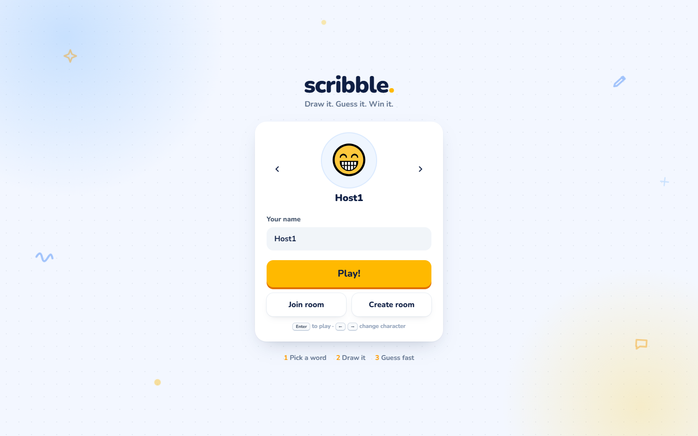
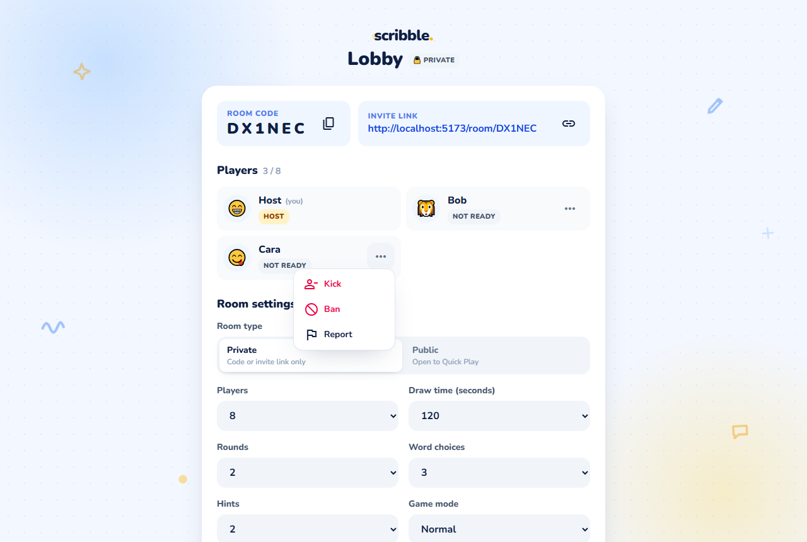
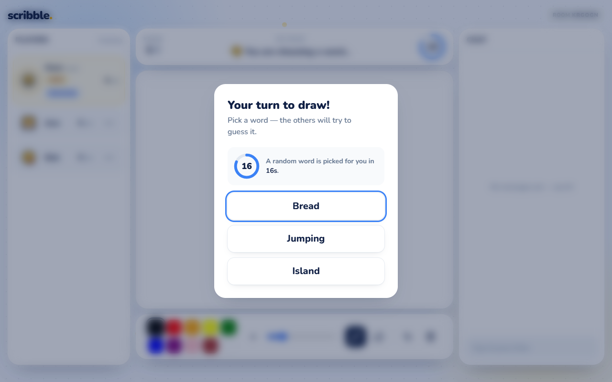
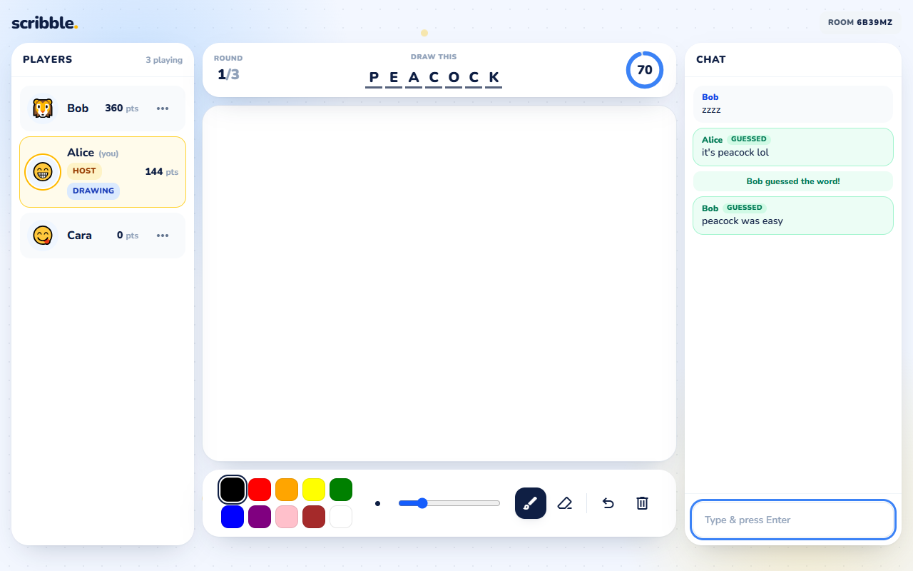
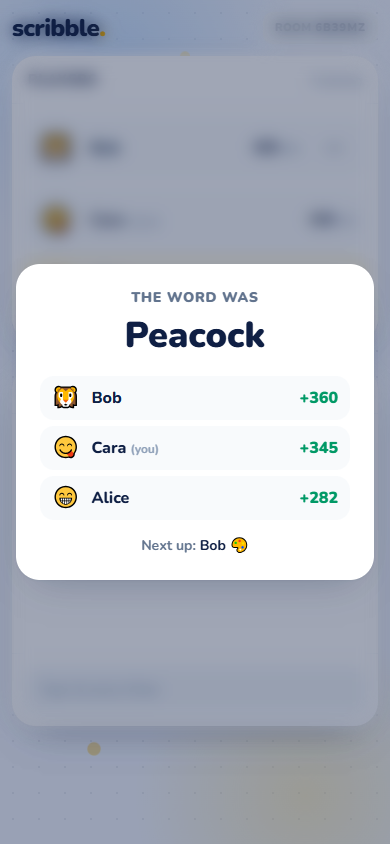
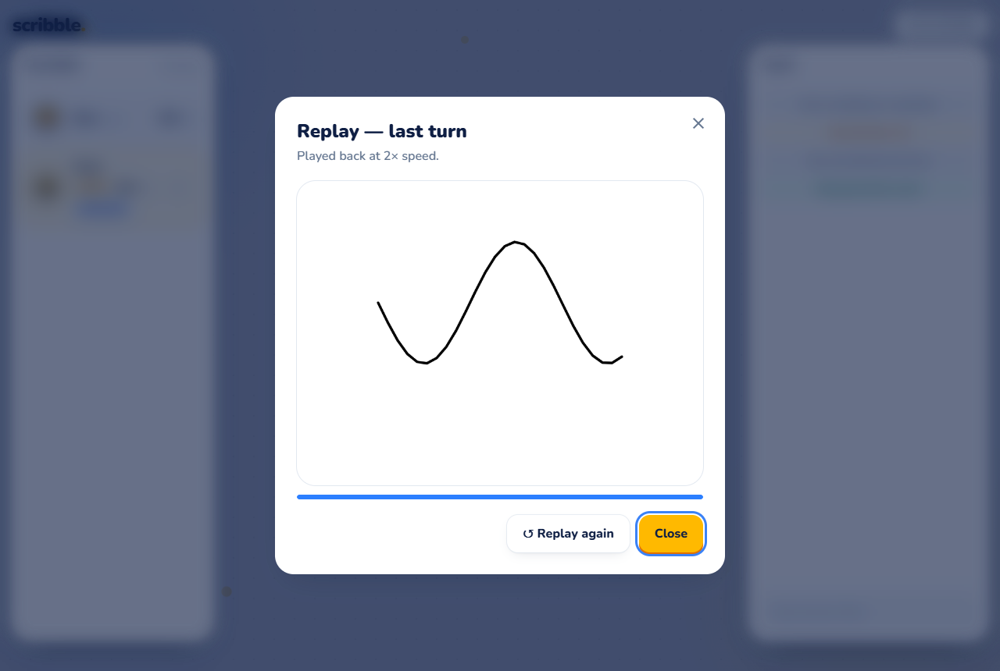
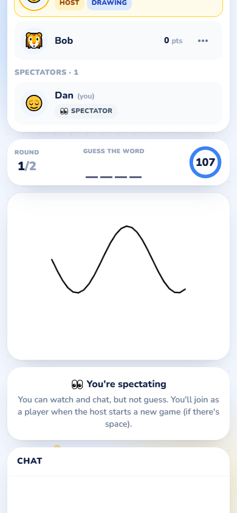
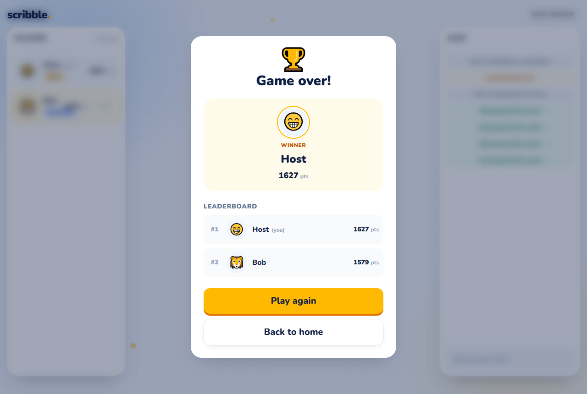

# 🎨 Scribble

A real-time multiplayer drawing-and-guessing game for the browser, inspired by skribbl.io with its own design.
Players join a room, take turns drawing a secret word, and everyone else races to guess it in chat.
Drawing, chat, timers and scores are synchronised live over WebSockets.

## 🌐 Live deployment

| | URL |
|---|---|
| Game (Render) | `https://scribble-client-x4zy.onrender.com/` ·Backend health check: `https://scribble-game-3aex.onrender.com/health` |

> The server runs on Render's free plan, so the first visit after a quiet period can take up to ~50 seconds
> while it wakes up. The game shows "Connecting to server…" until then.

---

## Screenshots

| Home | Lobby (settings, ready-up, moderation menu) |
|---|---|
|  |  |

| Choosing a word (20 s countdown) | Drawing + chat (word-leak protection) |
|---|---|
|  |  |

| Round end (mobile) | Replay | Spectator (mobile) | Results |
|---|---|---|---|
|  |  |  |  |

---

## Features

**Must have**
- Create a room (private by default) or join one by **room code** or **invite link**
- **Quick Play** joins an open public room, or creates one
- Lobby with a live player list, copy code / link buttons, and host-only **Start** (needs at least 2 players)
- Turn-based rounds: the drawer picks a word, everyone else guesses
- **Real-time drawing**: brush, 10 colours, sizes, eraser, undo, clear (sent as strokes, not images)
- Guessing through chat, with **scores** (faster = more points) and a **leaderboard**
- Server-side **timer**, round-end screen with the word, game-over screen with the winner

**Should have**
- Room settings: players (2–20), rounds (2–10), draw time (15–240 s), **word choices (1–5)**, **hints (0–5)**, **word category**
- **Public / private** rooms (Quick Play only ever uses public rooms)
- **Lobby settings panel** the host can edit live (read-only for others)
- **Ready-up**: Start is enabled only when every other player is ready
- **20 s word choice** with a countdown everyone sees, and a random pick at 0
- Smarter matching: case, spaces, accents and punctuation are ignored; **"close" guesses** get a private hint
- **Word-leak protection**: the word is only ever sent to the drawer and to players who already guessed it
- Chat **rate limit** (5 messages / 3 s) and server-side text cleanup
- Round-end screen with **points earned this turn** and who draws next

**Nice to have**
- 3 game modes: Normal, Hidden (no blanks or hints), Combination (two words joined with `+`)
- Evenly spaced letter hints (never more than half the letters)
- Keyboard shortcuts: `Enter` to play, `←` / `→` to pick a character
- Responsive (desktop, tablet, phone), accessible (focus rings, labels, reduced motion), one consistent design system
- "Connecting to server…" / "Reconnecting…" toasts; the lobby re-joins automatically after a drop

**Bonus**
- Object-oriented server: `Room`, `Game`, `Player`, `MessageHandler` (one place for validation and permissions)
- Host **kick** and **ban** (bans follow a persistent browser id), **vote kick**, **report**
- **Custom word list** (merged with, or replacing, the built-in words; only the host sees the list)
- **Spectator mode**: joining after the game has started makes you a spectator — you see the live canvas, scores, timer and chat
  and can chat, but the server blocks drawing, guessing, word choice and scoring; spectators become players on "Play again"
- **Replay** of the last turn at 2× speed
- **Hindi (romanized)** word list with a Language setting
- **Play again**: the host takes everyone back to the lobby

---

## Tech stack

| Part | Technology |
|---|---|
| Client | React 19, Vite 8, React Router 7, Tailwind CSS 4, socket.io-client 4, react-hot-toast |
| Server | Node.js (ES modules), Express 5, Socket.IO 4 — all state in memory |
| Tests | Node's built-in test runner (`node:test`) with real Socket.IO clients |
| Hosting | Client on **Vercel**, server on **Render** |

---

## Project structure

```text
scribble-clone-main/
├── client/                    React app (Vite)
│   ├── src/
│   │   ├── pages/             login.jsx (Home), lobby.jsx, playground.jsx (Game)
│   │   ├── components/        drawing board, tools, chat, word bar, dialogs, replay, settings form…
│   │   ├── ui/                reusable design system (Button, Card, Modal, PlayerCard, Timer…)
│   │   ├── socket/socket.js   the single Socket.IO connection
│   │   └── utils/clientId.js  persistent browser id (for bans)
│   ├── vercel.json            send every route to index.html
│   └── .env.example
├── server/                    Node + Socket.IO
│   ├── index.js               Express (/, /health), CORS, Socket.IO, route registration
│   ├── socket/MessageHandler.js
│   ├── handlers/              room, game, drawing, chat, moderation events
│   ├── models/                Room, Game, Player
│   ├── managers/              RoomManager, ChatManager
│   ├── utils/                 settings, words, hints, word matching, rate limiter, CORS origins
│   ├── data/                  words.js (English), words.hi.js (Hindi)
│   ├── tests/                 88 automated tests
│   └── .env.example
├── render.yaml                Render configuration for the server
├── ARCHITECTURE.md            how it works (diagrams, events, interview notes)
├── DEPLOY.md                  step-by-step deployment
└── docs/screenshots/
```

---

## Setup instructions

### Prerequisites
- **Node.js 20 or newer** (tested on 22) and **npm** — check with `node -v` and `npm -v`
- **Git**, to clone the repository
- Two terminal windows (one for the server, one for the client)

### 1. Get the code

```bash
git clone <your-repository-url>
cd scribble-clone-main
```

### 2. Start the server (terminal 1)

```bash
cd server
npm install
npm run dev
```

You should see `SERVER RUNNING ON 3001`. Check it at http://localhost:3001/health → `{"status":"ok"}`.
(`npm run dev` restarts on changes; `npm start` runs plain `node index.js`, like production.)

### 3. Start the client (terminal 2)

```bash
cd client
npm install
cp .env.example .env      # Windows (Command Prompt): copy .env.example .env
npm run dev
```

`client/.env` contains `VITE_SERVER_URL=http://localhost:3001`, so the client talks to your local server.

### 4. Play

Open **http://localhost:5173**. To play with yourself, use a second browser or a private window
(each window needs its own name): create a room in one and join it with the code in the other.

### 5. Run the tests (optional)

```bash
cd server
npm test
```

### Troubleshooting
- **"Connecting to server…" never goes away:** the server isn't running, or `client/.env` points somewhere else.
- **Port already in use:** another copy of the server is running — stop it, or start this one with a different `PORT`
  (and update `VITE_SERVER_URL` to match).
- **Changes to `client/.env` don't apply:** restart `npm run dev` in `client/`.

### Environment variables

| Variable | Where | Default | Purpose |
|---|---|---|---|
| `VITE_SERVER_URL` | client (`client/.env`, or Vercel) | `http://localhost:3001` | Address of the Socket.IO server. Built into the bundle, so redeploy after changing it. |
| `PORT` | server (Render sets it) | `3001` | Port the server listens on |
| `CLIENT_URL` | server (Render) | `http://localhost:5173` | Comma-separated list of allowed browser origins (CORS). `*` matches one part of a domain name, e.g. `https://my-app-*.vercel.app` for preview URLs. |
| `NODE_VERSION` | server (Render) | — | Node version Render installs (`render.yaml` uses `22.12.0`) |

The server reads its variables from the environment (it doesn't load `.env` files); locally the defaults just work.

### Scripts

| Folder | Command | What it does |
|---|---|---|
| `server` | `npm run dev` | Development server with auto-restart (nodemon) |
| `server` | `npm start` | Production server (`node index.js`) |
| `server` | `npm test` | All automated tests (~1 minute) |
| `client` | `npm run dev` | Vite dev server |
| `client` | `npm run build` | Production build into `client/dist` |
| `client` | `npm run lint` | ESLint |

---

## Testing

### Automated (server)

```bash
cd server
npm test
```

**88 tests** using Node's built-in test runner. The integration tests start a real server process and connect real
Socket.IO clients, so they test the actual network behaviour:

| File | Covers |
|---|---|
| `roomSettings.test.js` | setting ranges, types, defaults |
| `hintsAndWords.test.js` | hint timing and limits, word options, categories, ready-up rules |
| `wordMatch.test.js` | normalisation (case, spaces, accents, punctuation), correct / close guesses, combination words, rate limiter |
| `wordSelection.test.js` | 20 s word choice, random auto-pick, double-click races, timer cleanup |
| `oop.test.js` | `Room` / `Game` / `Player` / `MessageHandler` |
| `rooms.integration.test.js` | create / join, public vs private, Quick Play, lobby settings, ready-up, malformed payloads |
| `guessing.integration.test.js` | guess flow, word-leak protection, round-end payload, rate limit, text limits |
| `phase4.test.js`, `phase4.integration.test.js` | kick / ban / vote kick / report, spectators + snapshot, replay data, custom words, Hindi, play again |
| `deploy.test.js` | `/health`, CORS allow-list, production scripts, `render.yaml` / `vercel.json`, reconnect after a server restart |

During development the UI was also checked with browser tests (Puppeteer + Chrome, several players,
desktop / tablet / phone sizes). Those scripts aren't part of this repository.

### Manual check (3 browser windows)
1. **Window 1:** create a room. It's private by default; try Word choices 5, Hints 0, a category, or Hindi.
2. **Window 2:** click **Play!**. You land in a *different*, public room (private rooms are code-only).
3. **Window 3:** **Join room** with the code. Settings are read-only; click **I'm ready**. Start unlocks in Window 1.
4. Start. The drawer has 20 s to pick (others see "… is choosing a word"). Draw; guess wrong, close and correct.
   Typing the word as the drawer never reaches the guessers.
5. After the turn: points this turn and **▶ Replay**. Open the invite link in a 4th window mid-game: it joins as a 👁 spectator (no guess box, can chat).
6. Try the **⋯** menu on a player (Kick / Ban / Report as host, Vote kick as others), then finish and use **Play again**.

---

## Deployment

Client → **Vercel**, server → **Render**. Full click-by-click guide: **[DEPLOY.md](DEPLOY.md)**.

1. Push the project to GitHub.
2. **Render** → New → Blueprint → pick the repo (uses `render.yaml`). Note the URL, check `/health`.
3. **Vercel** → New Project → same repo, **Root Directory `client`**, env `VITE_SERVER_URL=<Render URL>` → Deploy.
4. **Render** → set `CLIENT_URL=http://localhost:5173,https://<your-app>.vercel.app` (Render redeploys).
5. Open the Vercel URL and put both URLs in **Live deployment** at the top of this file.

### Why the server runs on Render and not on Vercel / Netlify

Vercel and Netlify run back-end code as **serverless functions**: each request starts a short-lived function
that stops as soon as it responds, and separate invocations don't share memory. A real-time game needs the
opposite: **one long-running process** that keeps every player's WebSocket connection open and keeps rooms,
timers and scores in memory. Serverless functions can't hold WebSockets open, and players wouldn't even share
a room. Render runs the server as an ordinary Node process (the same `node index.js` you run locally), so
Socket.IO works unchanged. The static React client is a perfect fit for Vercel's CDN, so each part is
hosted where it works best.

---

## How to play

1. Pick a name and a character, then **Play!**, **Join room** or **Create room**.
2. In the lobby everyone except the host clicks **I'm ready**; the host presses **Start Game**.
3. When it's your turn, choose a word within 20 s and draw it. Everyone else types guesses.
4. Faster correct guesses score more; the drawer scores for every correct guess.
5. After the last round the winner is shown, and the host can **Play again**.

---

## Known limitations

- **No database:** rooms live in server memory and disappear on a restart, a redeploy or a free Render instance going to sleep.
- **No resuming a game in progress:** after a dropped connection the lobby re-joins automatically, but a player mid-game is sent Home.
- **No accounts:** names aren't unique, and bans follow a browser id stored in local storage (clearing site data gets around a ban).
- **Free Render instance:** sleeps after ~15 min idle; the first visit then takes up to ~50 s (the app shows a "Connecting…" toast).
- **Reports** are only written to the server log.
- **Single server instance:** all players of a room must reach the same server (no horizontal scaling).

---

## More documentation

- **[ARCHITECTURE.md](ARCHITECTURE.md)**: diagrams, drawing pipeline, game state, WebSockets, word matching, deployment, sequence diagram, full socket event table
- **[DEPLOY.md](DEPLOY.md)**: step-by-step deployment on Render and Vercel

---

## Author

Utkarsh Kumar Singh
